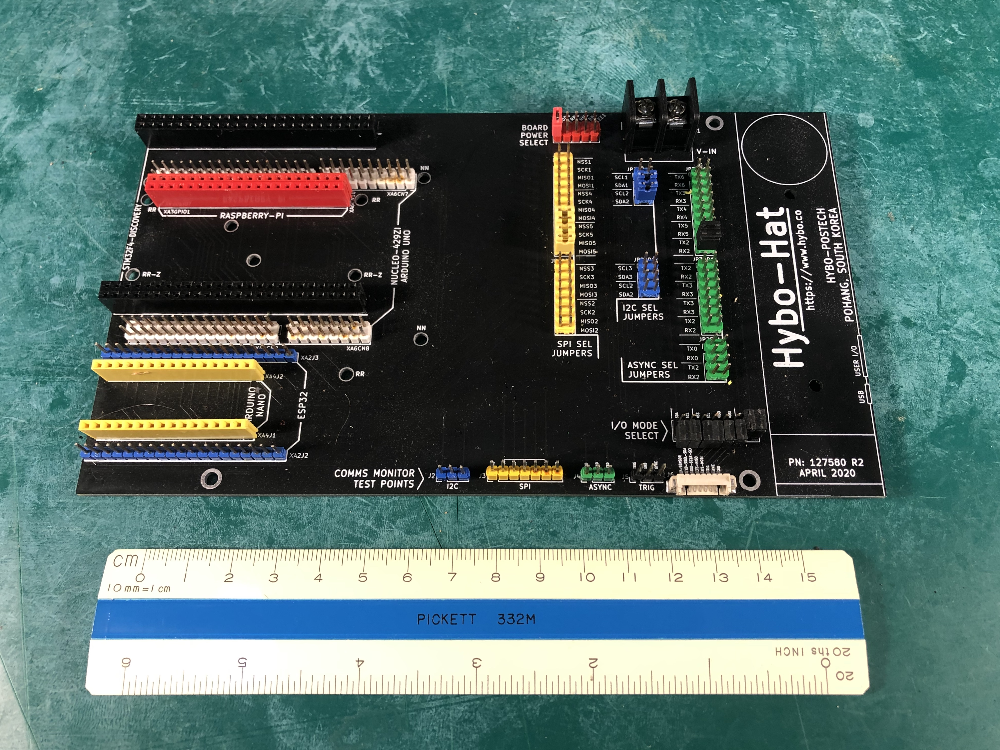

# Hybohat Development Board 

The Hybohat module was designed as a simple, passive way to interconnect
the User I/O connector of the iLidar to a variety of common development
boards.  These are:

* STM32F4 Discovery
* Arduino Uno & Leonardo
* STM32F429ZI Nucleo
* ESP32
* Raspberry Pi & Pi Zero
* Arduino Nano (and STM32F103 Nano form-factor)

## Concept

The board can be envisioned as a large cross-bar switch with each
dev board's I/O ports conected to a bus.  In case a development board
has multiple ports of the same time, the desired port is selected with 
jumpers in the three vertical columns labeled 

* `SPI SEL JUMPERS` (JP4NN1, JP4DD1)
* `I2C SEL JUMPERS` (JP2NN1, JP2DD1)
* `ASYNC SEL JUMPERS` (JP3NN1, JP3DD1, JP2EE1)

One end of this bus is connected to iLidar's User I/O
connector by the jumper block labeled: `I/O MODE SELECT (JP6)`
Note that only one mode can be operational at a time.

The other end of the bus is terminated in four connectors which can be
used to probe and monitor the I/O:

* `I2C` (J2)
* `SPI` (J3)
* `ASYNC` (J4)
* `TRIG` (J5)

## Development Boards

IMPORTANT: ONLY ONE DEVELOPMENT BOARD MAY BE CONNECTED AT ONE TIME

* Module A2, ESP32
  - XA2J2
  - XA2J3

* Module A3, Raspberry Pi & Pi Zero
  - XA3GPIO1

* Module A4, Arduino Nano
  - XA4J1 
  - XA4J2 

* Module A5, STM32F4 Discovery 
  - XA5P1
  - XA5P2

* Module A6, STM32F429ZI Nucleo Arduino Uno & Leonardo
  - XA6CN7
  - XA6CN8
  - XA6CN9
  - XA6CN10

